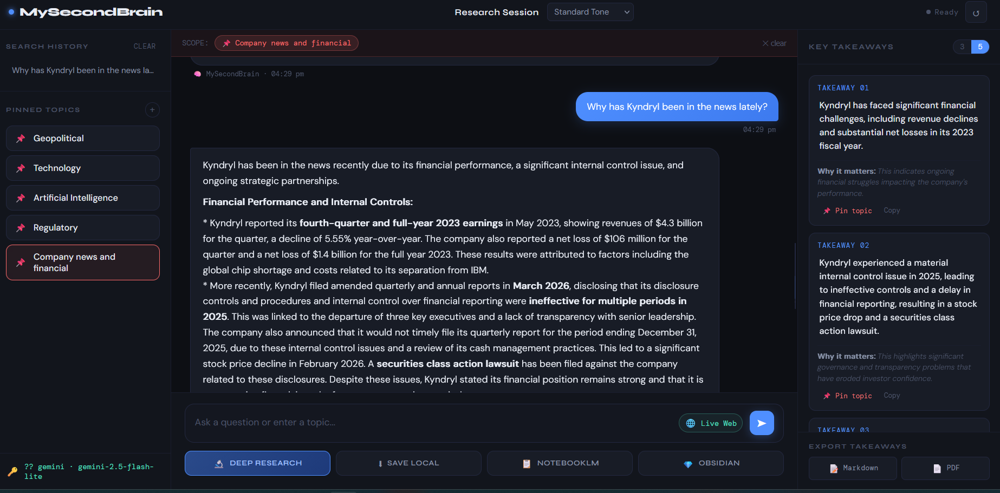

# 🧠 MyResAssist

A personal AI research assistant that runs entirely in your browser — on desktop or mobile. No backend, no server, no subscriptions — just bring your own API key and start researching.

**[Live Demo →](https://abhishek-sinha-bgl.github.io/MyResAssist/)**

---

## What it does

MyResAssist helps you research topics deeply and retain what matters. Chat with an AI that searches the web in real time, automatically extracts key takeaways, suggests follow-up questions, and flags when new findings contradict earlier ones. Works seamlessly on both desktop and mobile browsers — the layout adapts automatically.

**Core features:**

- **Live web search** — responses grounded in current information, not just training data
- **Streaming responses** — see answers appear token by token, no waiting
- **Key Takeaways** — auto-extracted after every response, always showing the top 5, with confidence ratings (High / Medium / Low) and contradiction detection
- **Follow-up chips** — 3 suggested next questions appear after each response, tap to use
- **Citations** — inline superscript links with a sources bar showing titles and domains
- **Research Deeper** — structured multi-angle report covering findings, perspectives, evidence, and implications; activates after your first query
- **Generate Summary** — produces a crisp summary (max 500 words + top 5 takeaways) of the full session at any point; shareable directly to WhatsApp, Email, Obsidian, NotebookLM and more
- **Session persistence** — all conversations saved locally in your browser, switchable from the sessions panel
- **Pinned Topics** — scope any session to a domain (Geopolitical, Technology, Regulatory, etc.) to keep responses focused
- **Voice input** — speak your research question on mobile; transcribed and sent automatically
- **Export** — save as Markdown, Obsidian note (with YAML frontmatter), plain text for NotebookLM, or copy to clipboard

---

## Mobile & Desktop

MyResAssist detects your device automatically when you open it and serves the appropriate layout — no separate URL or app install needed.

**Desktop** — three-panel layout: sessions and pinned topics on the left, chat in the centre, key takeaways on the right.

**Mobile** — single-screen layout optimised for touch:
- Horizontally scrollable topic pills at the top
- Full-screen chat with native-feeling bubbles
- Action bar with Research Deeper, Summary, Takeaways, Save, and Obsidian buttons
- Mic button for voice input using the device's speech recognition
- Takeaways and Sessions open as slide-up bottom sheets
- Summary share sheet triggers the system share dialog (WhatsApp, Gmail, Messages, etc.) or downloads formatted files for Obsidian and NotebookLM

---

## Supported AI Providers

MyResAssist uses a **Bring Your Own Key (BYOK)** model. Your key is stored only in your browser's `localStorage` and sent directly to the provider — nothing passes through any server.

| Provider | Models | Web Search |
|----------|--------|------------|
| **Anthropic Claude** | Sonnet 4, Opus 4.5, Haiku 4.5, and more | ✅ Native (web_search tool) |
| **OpenAI** | GPT-4o, GPT-4o Mini, o1, o3-mini, and more | Extracts URLs from responses |
| **Google Gemini** | 2.0 Flash, 1.5 Flash, 1.5 Pro, 2.5 previews | ✅ Native (Google Search grounding) |
| **Custom (OpenAI-compatible)** | Any model — Groq, Mistral, Together AI, Ollama, LM Studio | Depends on provider |

The model dropdown fetches live models from each provider's API so you always see what's currently available, including newly released models.

---

## Getting Started

### 1. Get an API key

Pick any one provider to start:

- **Gemini (easiest/free tier)** → [aistudio.google.com](https://aistudio.google.com) — sign in with Google, grab a key instantly. Use `gemini-1.5-flash` for the free tier.
- **Claude** → [console.anthropic.com](https://console.anthropic.com) — pay-as-you-go, ~$5 of free credit on signup
- **OpenAI** → [platform.openai.com](https://platform.openai.com) — pay-as-you-go

### 2. Open the app

Visit the [live demo](https://abhishek-sinha-bgl.github.io/MyResAssist/), or open `index.html` directly in your browser — it works as a local file too.

### 3. Configure your key

Click the 🔑 button (desktop: bottom-left corner; mobile: top-right). Select your provider, paste your key, choose a model, and click **Save**. Your key is stored in your browser and won't need to be re-entered.

### 4. Start researching

Type a question or speak it (mobile). Toggle **Live Web** for real-time search results. After your first response, Research Deeper, Generate Summary, and all export options become available.

---

## Deployment on GitHub Pages

1. Fork or clone this repository
2. Ensure the file is named `index.html` at the root
3. Go to **Settings → Pages**
4. Set source to **Deploy from branch → main → / (root)**
5. Click **Save** — live in ~60 seconds at `https://yourusername.github.io/reponame`

No build step, no dependencies, no Node.js required.

---

## Using Custom Providers

Any OpenAI-compatible endpoint works. In the provider config modal, click **+ Custom** and fill in:

| Field | Example |
|-------|---------|
| Provider Name | Groq |
| API Endpoint | `https://api.groq.com/openai/v1/chat/completions` |
| API Key | your Groq key |
| Model Name | `llama-3.3-70b-versatile` |

**Popular compatible providers:**

- **Groq** — extremely fast inference, generous free tier → [console.groq.com](https://console.groq.com)
- **Mistral** → [console.mistral.ai](https://console.mistral.ai)
- **Together AI** → [api.together.xyz](https://api.together.xyz)
- **Perplexity** → [perplexity.ai/settings/api](https://www.perplexity.ai/settings/api)
- **Ollama (local)** → endpoint: `http://localhost:11434/v1/chat/completions`, key: `ollama`
- **LM Studio (local)** → endpoint: `http://localhost:1234/v1/chat/completions`

---

## Privacy & Security

- **Your API keys never leave your browser.** Stored in `localStorage` and used only for direct HTTP requests to your chosen provider.
- **No analytics, no tracking, no ads.** A static HTML file with no external scripts beyond Google Fonts.
- **No intermediary server.** The app has no backend of any kind.
- Keys persist in your browser until you clear site data. They do not transfer to other browsers or devices — each needs its own key configured once.

---

## Features In Detail

### Pinned Topics
Activate a pinned topic to scope all responses to that lens — e.g. "Regulatory" biases answers toward regulatory angles. Click again to deactivate. Add custom topics with the **+** button. On mobile, topics appear as a scrollable pill strip at the top of the screen.

### Confidence Indicators
Each takeaway is rated High / Medium / Low by the AI based on how well-supported the claim is. High means multiple corroborating sources; Low means speculative or single-source claims.

### Contradiction Detection
When new takeaways are generated, previous ones are passed as context. If a new finding conflicts with an earlier takeaway, the card is highlighted with a note identifying the specific contradiction. Useful for fast-moving stories.

### Research Deeper
Sends a structured prompt requesting a multi-angle report: overview, key findings with evidence, multiple stakeholder perspectives, specific data points, forward implications, and open questions. Only becomes available after your first query has been answered.

### Generate Summary
Produces a crisp summary of everything discussed so far — max 500 words plus a numbered Top 5 Takeaways list. On desktop, the summary appears in chat with copy and save-as-markdown options. On mobile, a share sheet offers: system share dialog (WhatsApp, Gmail, Messages, etc.), download for Obsidian (.md with YAML frontmatter), download for NotebookLM (.txt), or copy to clipboard.

### Voice Input (Mobile)
Tap the microphone button to open the voice modal. Speak your question — interim transcript is shown as you speak. On completion, the transcript fills the input field ready to send. Uses the Web Speech API, supported on Chrome for Android and Safari on iOS.

### Sessions
All research sessions are saved automatically with a title derived from your first question. Switch between sessions from the sessions panel (desktop left sidebar; mobile bottom sheet) — full conversation history, takeaways, and topic scope are all restored.

### Export Options

| Option | Format | Best for |
|--------|--------|----------|
| Save Local | `.md` file download | Personal notes, local Obsidian vault |
| Obsidian | `.md` with YAML frontmatter | Direct import to Obsidian |
| NotebookLM | `.txt` download or clipboard | Upload as a source in Google NotebookLM |
| Markdown | Clipboard copy | Pasting into any markdown editor |

---

## Keyboard Shortcuts

| Key | Action |
|-----|--------|
| `Enter` | Send message |
| `Shift + Enter` | New line in input |

---

## Roadmap Ideas

- [ ] Multi-step deep research with sequential web searches and synthesis
- [ ] Document and image analysis (upload PDFs, screenshots, web pages)
- [ ] Cross-device session sync via GitHub Gist or similar
- [ ] Search within conversation history
- [ ] Shareable read-only session links

---

## License

MIT — do whatever you want with it.

---

*Built as a single HTML file. No frameworks, no build tools, no dependencies. Works on desktop and mobile browsers straight from GitHub Pages.*
